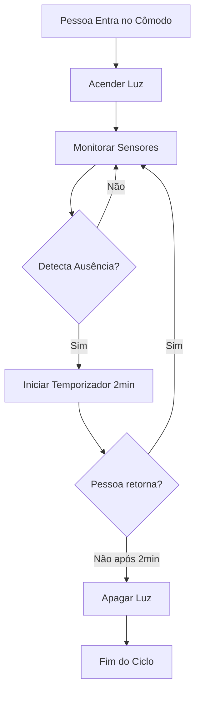
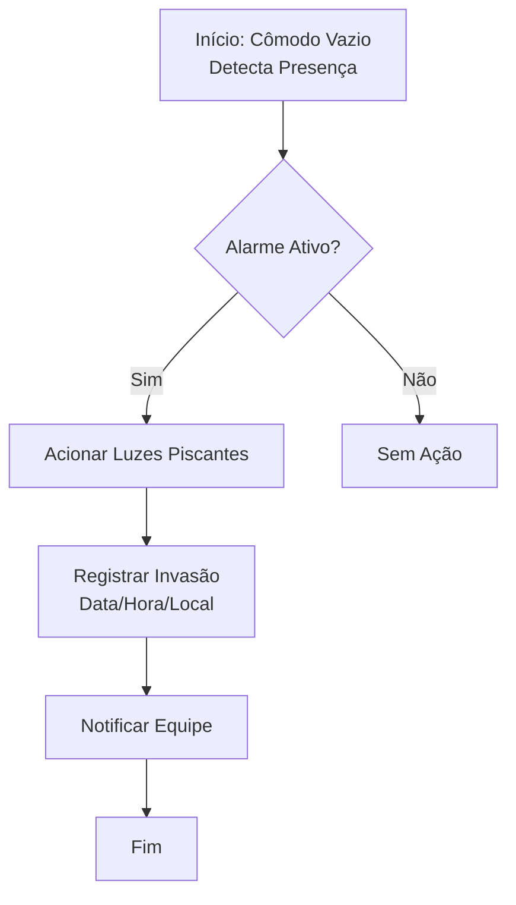
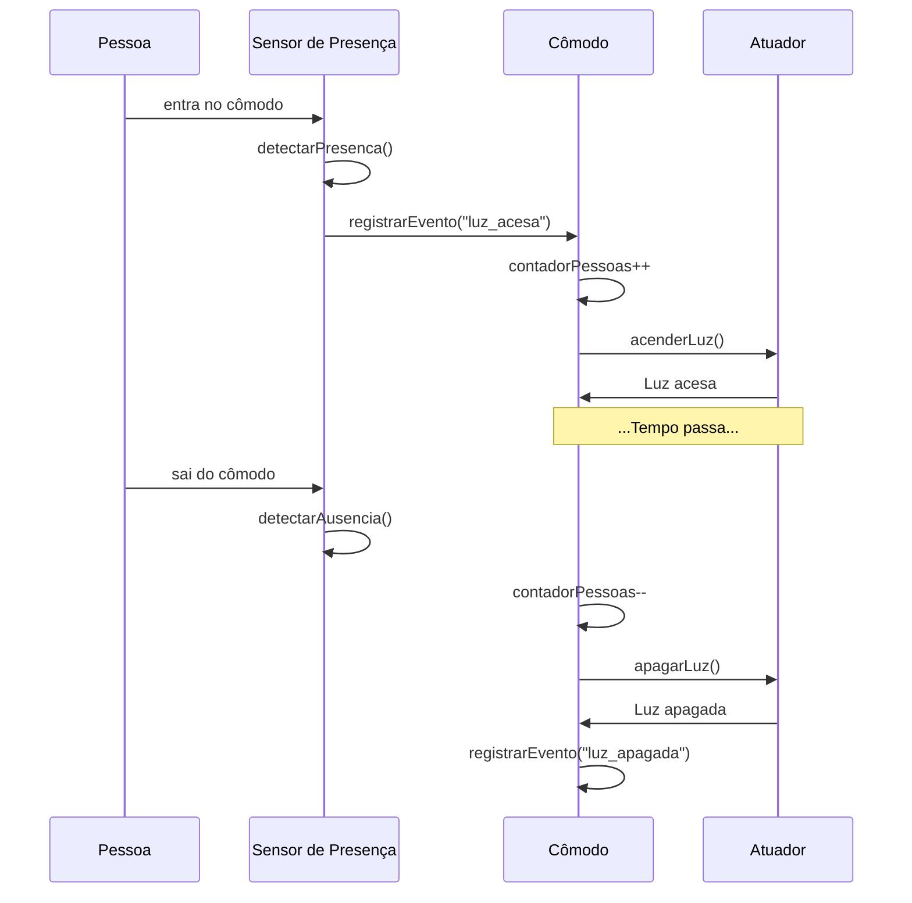
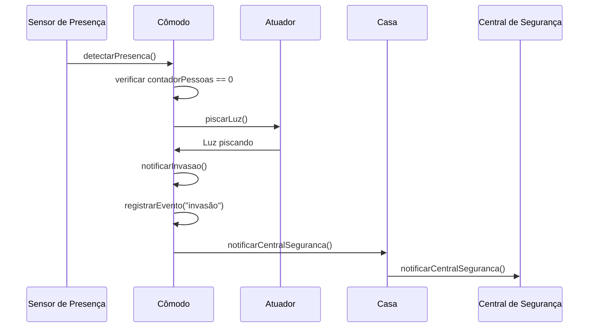
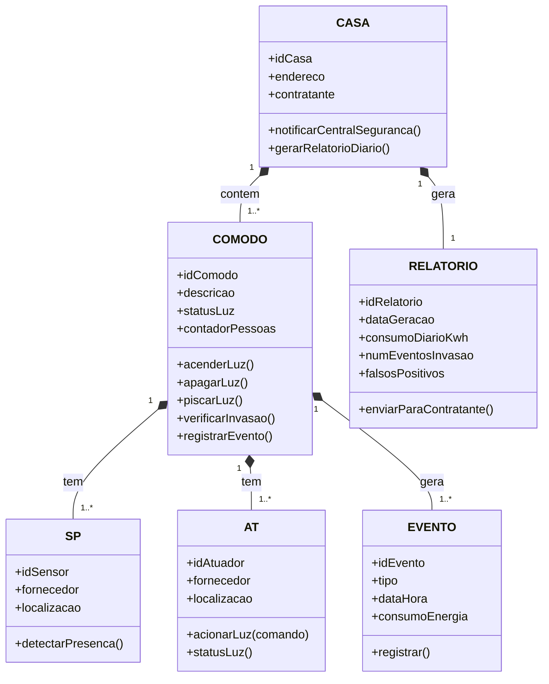

# Objetivo do Sistema

O sistema tem como objetivo principal automatizar o controle de iluminação e segurança em uma casa inteligente, proporcionando conforto e proteção aos moradores. Para garantir o conforto, as luzes são acionadas automaticamente quando uma pessoa entra em um cômodo e desligadas quando o ambiente fica vazio, eliminando a necessidade de intervenção manual e melhorando a eficiência energética. Já no aspecto de segurança, o sistema é capaz de detectar invasões em cômodos que deveriam estar desocupados. Quando uma presença é identificada nesses ambientes, o sistema aciona um alerta visual, fazendo as luzes piscarem, e registra o evento como um alarme para posterior verificação.
Processos de negócio

## 1. Controle de Iluminação Automática
O fluxo normal de operação do sistema envolve o gerenciamento inteligente das luzes com base na presença de pessoas. Quando alguém entra em um cômodo, os sensores de presença (SP) detectam o movimento e enviam um sinal para os atuadores de luz (AT), que acendem as lâmpadas. Por outro lado, quando a última pessoa deixa o ambiente, os sensores identificam a ausência de movimento, e os atuadores desligam as luzes automaticamente. Esse processo garante que a iluminação seja utilizada apenas quando necessário, reduzindo o desperdício de energia.

## 2. Controle de Invasão
Em situações excepcionais, como uma possível invasão, o sistema entra em ação para proteger a residência. Se um cômodo que deveria estar vazio apresenta detecção de presença, o sistema interpreta isso como uma invasão. Nesse caso, as luzes do ambiente começam a piscar, servindo como um alerta visual para chamar a atenção de moradores ou vizinhos. Simultaneamente, o evento é registrado em um log de alarmes, permitindo que os usuários verifiquem os incidentes posteriormente e tomem as medidas necessárias, como acionar a segurança ou notificar as autoridades.
Esses processos combinados tornam a casa mais inteligente, segura e eficiente, atendendo tanto às necessidades cotidianas de conforto quanto às demandas críticas de segurança.

<b>Controle de iluminação (normal)</b>

<b>Controle de iluminação (invasão)</b>

# Requisitos Funcionais (RF)

### **RF01 – Controle Automático de Iluminação**
- **RF01.1** – Ao detectar a entrada de uma pessoa em um cômodo (via sensores de presença), o sistema deve acender a luz em até **500ms**.  
- **RF01.2** – Ao detectar a saída da última pessoa do cômodo (via ausência de movimento por **2 minutos**), o sistema deve desligar a luz.  

### **RF02 – Controle de Invasão**
- **RF02.1** – Se presença for detectada em um cômodo previamente vazio (sem registro de acesso autorizado), o sistema deve: Piscar as luzes (3 vezes em 10 segundos) e notificar a central de segurança em até 10 segundos.

### **RF03 – Geração de Relatórios**
- **RF03.1** – Relatórios diários de consumo de energia (**kWh**) e eventos de invasão devem ser enviados para o contratante (representante da casa) até **6:00 da manhã** do dia seguinte.  
- **RF03.2** – Dados devem incluir:  
  - Tempo médio de uso por cômodo.  
  - Número de falsos positivos (meta: **menos de 1%**).  

# Requisitos Não Funcionais (RNF)

### **RNF01 – Escalabilidade**
O sistema deve suportar:  
- **10.000 casas** (≈ **50.000 cômodos**, considerando 5/casa).  
- Armazenamento de dados por **12 meses**.  

### **RNF02 – Confiabilidade**
- **Disponibilidade**: 99,99% (uptime anual máximo de **52 minutos**).  
- **Taxa de falha**:  
  - Falsos negativos em invasão: **menos de 1%**.  
  - Atraso na iluminação: **menos de 5%**.  

### **RNF03 – Tempo de Resposta**
- **Luzes**: Ativação em até **500ms** pós-detecção.  
- **Invasão**: Notificação em até **10 segundos**.  

<b>Diagrama de sequência (normal)</b>

<b>Diagrama de sequência (invasor)</b>

<b>Diagrama de classes</b>

# Arquitetura de Componentes

**Componente de Gerenciamento de Casas (CASA):**
- Responsável por gerenciar a camada de agregação, representando cada uma das 10.000 casas.
- Lida com a notificação à central de segurança e a geração de relatórios diários.
- Deve ser distribuído para suportar a carga de 10.000 casas simultaneamente.

**Componente de Gerenciamento de Cômodos (CÔMODO):**
- Gerencia operações específicas de cada cômodo: acender, apagar e piscar luzes, verificar invasões e registrar eventos.
- Precisa ser escalável e rodar em ambiente distribuído (estimativa de 50.000 cômodos).

**Componente de Sensores (SP):**
- Agrupa a lógica de detecção de presença (SP).
- Captura entradas e saídas de pessoas, garantindo a ativação das luzes em menos de 500ms.

**Componente de Atuadores (AT):**
- Interface com dispositivos físicos que controlam as luzes.
- Recebe comandos como `acender()`, `apagar()` e `piscar()` do componente CÔMODO e os executa de forma confiável e rápida.

**Mecanismos para Requisitos Não Funcionais:**
- **Escalabilidade (RNF01):** Arquitetura de microserviços, cada componente como microserviço independente via APIs. Base de dados distribuída (ex: sharding) para lidar com grande volume de dados.
- **Confiabilidade (RNF02):** Alta disponibilidade (99,99%) via redundância e balanceamento de carga. Réplicas em diferentes zonas de disponibilidade.
- **Tempo de Resposta (RNF03):** Comunicação otimizada entre SP, CÔMODO e AT para latência mínima. Mensageria assíncrona (ex: Kafka) para garantir a ativação da luz em menos de 500ms e notificação de invasão em até 10 segundos.

# Plataformas, Ferramentas e Linguagens

- **Plataforma de Nuvem:** AWS, Google Cloud ou Azure para infraestrutura escalável e disponível.
- **Contêineres e Orquestração:** Docker para empacotar e gerenciar microserviços, facilitando implantação e escalabilidade automática.
- **Base de Dados:** PostgreSQL armazenamento dos dados de 12 meses de 10.000 casas.
- **Mensageria:** Apache Kafka ou RabbitMQ para comunicação assíncrona entre componentes, garantindo performance e resiliência.
- **Monitoramento:** Grafana para monitorar desempenho, disponibilidade e saúde dos componentes, garantindo confiabilidade.
- **Linguagens de Programação:** Java para ambientes distribuídos e escaláveis.

# Autoria e Desenvolvimento 
**Autora Principal:**  
Karine Victoria Rosa da Paixão

**Processo de Revisão e Aprimoramento:**  
Este documento foi revisado e otimizado com o apoio das seguintes ferramentas de IA generativa:

- [DeepSeek](https://chat.deepseek.com/)
- [Gemini](https://gemini.google.com/)
- [GPT-4](https://chat.openai.com/)

Para além do uso para correção de textos, as IAs foram usadas para a geração e correção do código Mermaid.